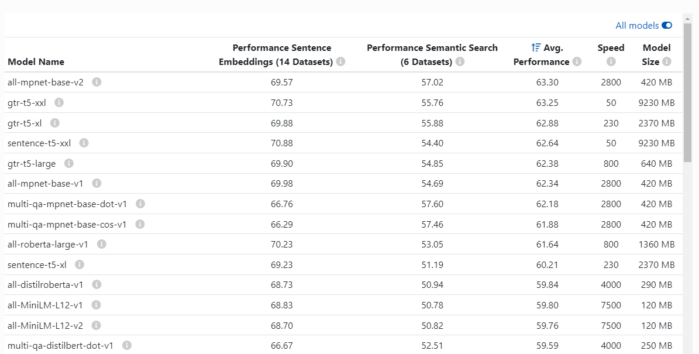

# Векторная база данных

исходя из официальной [документации](https://www.sbert.net/docs/sentence_transformer/pretrained_models.html)
была выбрана модель [all-mpnet-base-v2](https://huggingface.co/sentence-transformers/all-mpnet-base-v2)
за лучший Avg. Perfomance, хорошую скорость и выгодный размер

>
> [официальная документация](https://www.sbert.net/docs/sentence_transformer/pretrained_models.html)

статьи arxiv относящиеся к разработке данной модели:

- [WikiHow: A Large Scale Text Summarization Dataset](https://arxiv.org/abs/1810.09305)
- [SearchQA: A New Q&A Dataset Augmented with Context from a Search Engine](https://arxiv.org/abs/1704.05179)
- [GooAQ: Open Question Answering with Diverse Answer Types](https://arxiv.org/abs/2104.08727)
- [PAQ: 65 Million Probably-Asked Questions and What You Can Do With Them](https://arxiv.org/abs/2102.07033)
- [A Repository of Conversational Datasets](https://arxiv.org/abs/1904.06472)