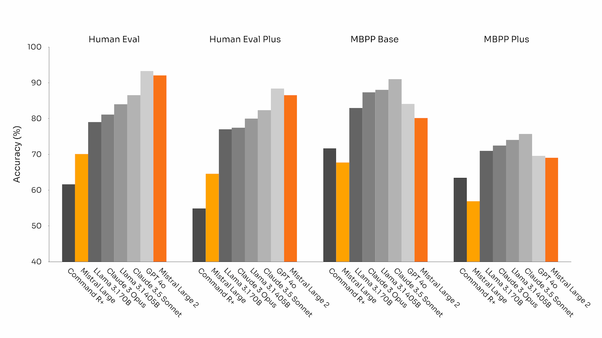
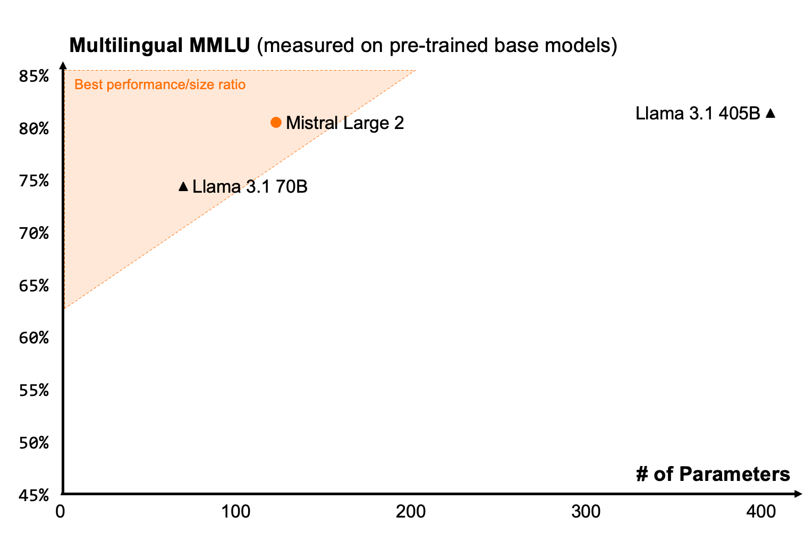
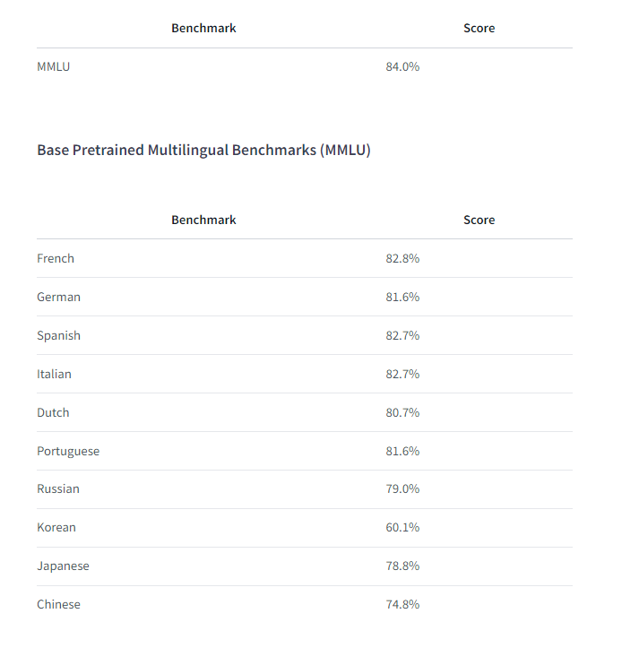

# Mistral Large 2
ниже представлена краткая информация о модели из [статьи на хабре](https://habr.com/ru/articles/831272/),
 официального репозитория [Hugging Face](https://huggingface.co/mistralai/Mistral-Large-Instruct-2407) и
официальной [статьи с сайта Mistral](https://mistral.ai/news/mistral-large-2407/)
>Значительные усилия были также направлены на улучшение возможностей модели в рассуждениях. Одной из ключевых областей фокусировки во время обучения было минимизировать тенденцию модели к «галлюцинациям» или генерированию правдоподобно звучащей, но фактически неверной или нерелевантной информации. Это было достигнуто путем тонкой настройки модели, чтобы она была более осторожной и разборчивой в своих ответах, гарантируя, что она будет предоставлять надежные и точные выходные данные.\
>Кроме того, новый Mistral Large 2 обучен распознавать, когда он не может найти решения или не имеет достаточной информации для предоставления уверенного ответа. Эта приверженность точности отражена в улучшенной производительности модели на популярных математических тестах, демонстрируя ее улучшенные навыки рассуждения и решения проблем:\

> [статья с сайта Mistral](https://mistral.ai/news/mistral-large-2407/)

>Mistral Large 2 обучена на большом многоязычном датасете, она демонстрирует высокую эффективность на таких языках, как английский, французский, немецкий, испанский, итальянский, португальский, голландский, русский, китайский, японский, корейский, арабский и хинди.\
\
\
> [статьи на хабре](https://habr.com/ru/articles/831272/), [Hugging Face](https://huggingface.co/mistralai/Mistral-Large-Instruct-2407)